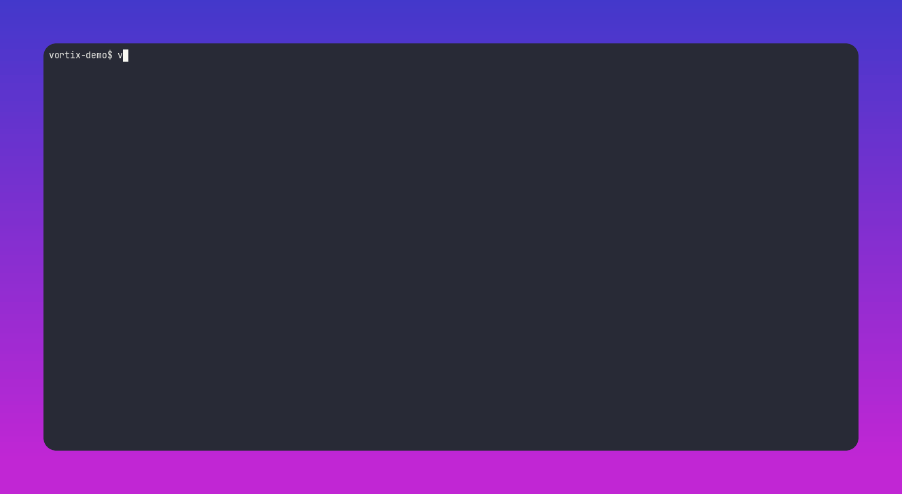

# Vortix CLI

[](https://www.npmjs.com/package/vortix-cli)
[](https://github.com/jannikmenzel/vortix-cli/actions/workflows/ci.yml)
[](./LICENSE)
[](package.json)

Local, no-account CLI that audits static sites for performance, security, accessibility, bugs, SEO, maintainability & privacy issues. Auto-detects Astro, Eleventy, Next.js, Nuxt, SvelteKit, Gatsby, Docusaurus, VuePress, Gridsome, Vite, MkDocs, Zola, Hugo, Hexo, Jekyll — or any generator via its output folder.



## Quick Start

```bash
npm install -D vortix-cli
npx vortix init
npx vortix check
```

Node.js `>=20` required. Chromium downloads automatically via `@playwright/browser-chromium`.

## Commands

```bash
npx vortix check
npx vortix check https://example.com
npx vortix ci
```

Checks run in one of three modes: **static** (built files on disk), **dynamic** (headless browser), **live** (a real HTTP request — only when you pass a URL, otherwise shown as skipped).

## Config

`vortix init` writes `.vortix/config.json`:

```json
{
  "target": { "adapter": "astro" },
  "categories": { "performance": true, "security": true, "privacy": false },
  "failOn": "error",
  "performance": { "budgets": { "lcpMs": 2500, "cls": 0.1, "maxPageWeightKb": 1500 } },
  "checks": ["./checks/no-todo-comments.js"]
}
```

## Custom checks

```js
// ./checks/no-todo-comments.js
import { defineCheck } from "vortix-cli";

export default defineCheck({
  id: "custom.no-todo-comments",
  category: "maintainability",
  mode: "static",
  severity: "warn",
  async run(ctx) {
    const files = await ctx.glob("src/**/*.{astro,md}");
    return files.filter((f) => ctx.readFile(f).includes("TODO")).map((f) => ctx.finding({ message: "Found a TODO", file: f }));
  },
});
```

Reference a local path or a published npm package in `checks: []`.

## Included checks

| Category | Checks |
|---|---|
| Performance | Core Web Vitals budget, page weight & image size, image formats, lazy loading, third-party impact |
| Security | `npm audit`, mixed content, security headers, HTTPS enforcement, server info disclosure, cookie security |
| Accessibility | WCAG 2.1 A/AA (axe-core), color contrast |
| Bugs | Broken links/images/assets, dangling anchors, invalid nesting, viewport meta, console errors |
| SEO | Meta/OG tags, OG images, canonical URL, structured data, robots.txt/sitemap |
| Maintainability | Code duplication, outdated deps, dead CSS, license check |
| Privacy | Tracking requests, external fonts/APIs, fingerprinting APIs |

Each run ends in a 0–100 score (A–F), averaged per-check → per-category so no category drowns out another. Any `error`-severity finding caps the grade at "C", regardless of the average.

## License

[MIT](./LICENSE)
